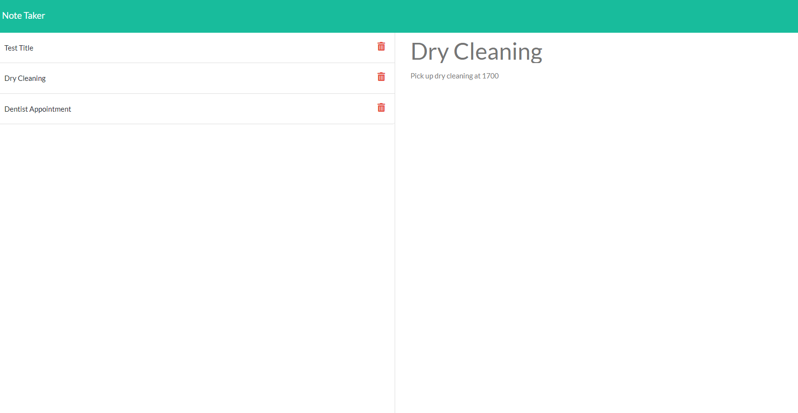

# Note Taker
***

## Table of Contents
* [Description](#description)
* [Deployment](#deployment)
* [Usage](#Usage)
* [Contact](#contact)
* [Repository](#repository)
### Description
This is modified starter code that creates an application called Note Taker that can be used to write and save notes.  This application uses an Express.js back end and will save and retrieve note data from a JSON file.
 
### Deployment
This application has been deployed at Heroku. [It can be located here](https://peaceful-bastion-34725.herokuapp.com/)
 
### Usage
Once the user clicks and opens the application they are presented with a landing page with a link to the notes page.  When the user clicks on the link to the note page he or she is presented with a page with existing notes listed in the left-handed column, plus empty fields to enter a new note title and the note's text in the right-hand column.  The user can enter a new note title and note text and then click the Save icon which will then save the note and move it into the left-column with other existing notes.
 
### Contact
If you have any questions about this project or would like to report and issue, please email Dan Golden and golden.daniel@gmail.com
 
#### Repository
https://github.com/DanPGolden/Team_Profile_Generator

